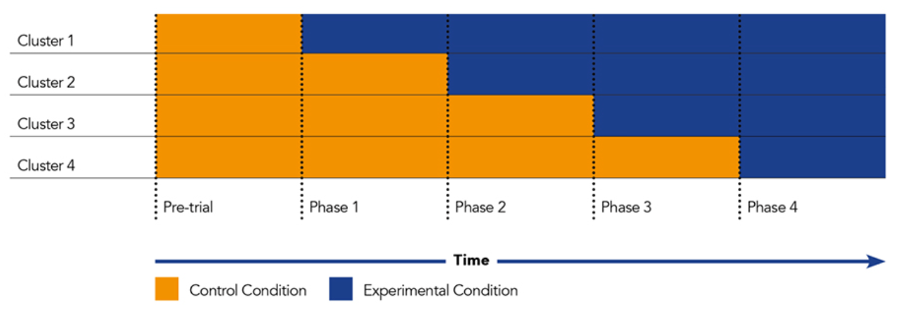
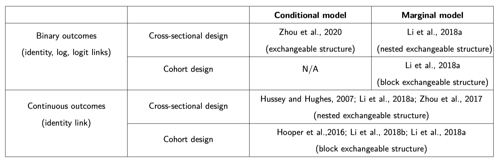
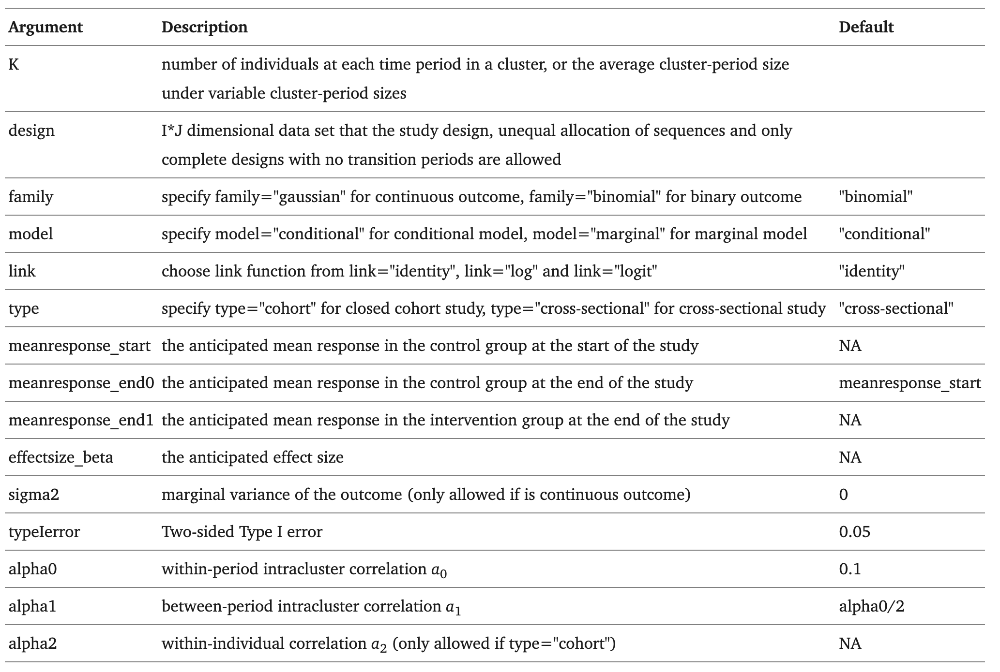

# swdpwr: Power Calculations in Stepped Wedge Cluster Randomized Trials

A pictorial representation of a stepped wedge trial, adapted from [Prof Karla Hemming & Prof Monica Taljaard. (2020). When is a stepped-wedge cluster randomised trial a good design choice? Research OUTREACH. (121)](https://researchoutreach.org/articles/stepped-wedge-cluster-randomised-trial-good-design-choice/) 

## 1. Methods and Scenarios Implemented in swdpwr


Hussey, M. A., & Hughes, J. P. (2007). Design and analysis of stepped wedge cluster randomized trials. Contemporary clinical trials, 28(2), 182-191.

Hooper, R., Teerenstra, S., de Hoop, E., & Eldridge, S. (2016). Sample size calculation for stepped wedge and other longitudinal cluster randomised trials. Statistics in medicine, 35(26), 4718-4728.

Li, F., Turner, E. L., & Preisser, J. S. (2018a). Sample size determination for GEE analyses of stepped wedge cluster randomized trials. Biometrics, 74(4), 1450-1458.

Li, F., Turner, E. L., & Preisser, J. S. (2018b). Optimal allocation of clusters in cohort stepped wedge designs. Statistics Probability Letters, 137, 257-263.

Zhou, X., Liao, X., Kunz, L. M., Normand, S. L. T., Wang, M., & Spiegelman, D. (2020). A maximum likelihood approach to power calculations for stepped wedge designs of binary outcomes. Biostatistics, 21(1), 102-121.

Zhou, X., Liao, X., & Spiegelman, D. (2017). “Cross-sectional” stepped wedge designs always reduce the required sample size when there is no time effect. Journal of clinical epidemiology, 83, 108-109.

## 2. R Package Installation
The R package has versions of **Package source**, **Windows binaries**, and **macOS binaries** maintained on CRAN: [https://CRAN.R-project.org/package=swdpwr](https://CRAN.R-project.org/package=swdpwr). The binary package can be installed by:
```r
install.packages("swdpwr")
library(swdpwr)
```

## 3. Usage
```r
swdpower(K, design, family, model, link, type, meanresponse_start, meanresponse_end0, meanresponse_end1, effectsize_beta, sigma2, typeIerror, alpha0, alpha1, alpha2)
```
## 4. Arguments


## 5. Details
This function `swdpower` performs power calculations for stepped wedge cluster randomized trials under different scenarios (presented in Section 1). 
### A note on assumptions on time effects
The default setting assumes no time effect, meaning the anticipated mean response in the control group at the end of the study (`meanresponse_end0`) is equal to that at the start of the study (`meanresponse_start`). To incorporate time effects, you can manually set `meanresponse_start` and `meanresponse_end0` to different values. For a model with time effects but approximating a "zero time trend", this can be achieved by setting `meanresponse_start` and `meanresponse_end0` to values that are close but slightly different, such as `meanresponse_start = x` and `meanresponse_end0 = x + 0.001` (with the difference being greater than 1e-5).

## 6. Return
The object returned by function `swdpower` has a class of `swdpower`, which includes a list of the design matrix and a summary of this design (including the power).

## 7. Useful Examples


## 7. Citation
If you use our ONDSA R package in your research, please cite our related publication/software (https://doi.org/10.1016/j.cmpb.2021.106522).
Chen, J., Zhou, X., Li, F., & Spiegelman, D. (2022). swdpwr: A SAS macro and an R package for power calculations in stepped wedge cluster randomized trials. Computer methods and programs in biomedicine, 213, 106522.

## 8. Contact
If you have any questions or suggestions, please create an issue on GitHub or contact the author/maintainer Jiachen Chen (chenjc@bu.edu).


